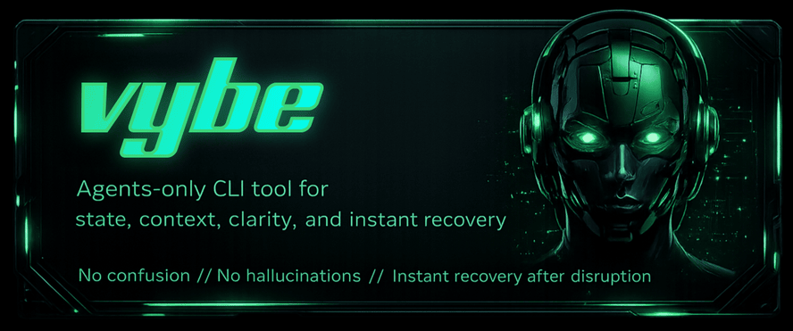

# vybe

`vybe` is a CLI that gives AI coding agents persistent working state.
It is designed for autonomous execution, with no human intervention required in the task loop.
Setup is quick, non-intrusive, and does not require changing your existing project architecture.
If you do not want it, uninstall is one command: `vybe hook uninstall` (or `vybe hook uninstall --opencode`).
It saves tasks, event history, memory, and artifacts in SQLite so agents can restart and continue from where they stopped.



## Why This Exists

AI coding agents lose all context when a session ends or crashes.
`vybe` gives them durable memory, task tracking, and deterministic
resume — so they pick up exactly where they left off.

## Get Started

```bash
# 1) install
go install github.com/dotcommander/vybe/cmd/vybe@latest

# 2) hook into your AI assistant
vybe hook install            # Claude Code
vybe hook install --opencode # OpenCode
```

That's it. Your agent now has continuity across sessions.

### What the hooks do

- **Session start:** runs `vybe resume` and injects task context, memory,
  and recent events into the agent's prompt
- **During work:** logs user prompts and failed tool calls for cross-session
  continuity and recovery
- **Before compaction/session end:** runs memory checkpoint (`memory compact` + `memory gc`)

### Optional: configure DB location

```yaml
# ~/.config/vybe/config.yaml
db_path: /Users/you/.config/vybe/vybe.db
```

Default: `~/.config/vybe/vybe.db`

### Uninstall hooks

```bash
vybe hook uninstall            # Claude Code
vybe hook uninstall --opencode # OpenCode
```

---

> **Below this line is reference for AI agents.**
> Humans: see `CLAUDE.md` for architecture or `docs/` for guides.

## Quick Start (60 Seconds)

```bash
# 1) install
go install github.com/dotcommander/vybe/cmd/vybe@latest

# 2) set identity once
export VYBE_AGENT=worker1

# 3) initialize state
vybe agent init --request-id init_1

# 4) create a task
vybe task create --request-id task_1 --title "Ship it" --desc "Do the thing"

# 5) resume work (cursor advances atomically)
vybe resume --request-id resume_1
```

If this works, your loop is ready.

## 5-Minute Work Loop

Use this exact order when you want low cognitive overhead.

```bash
export VYBE_AGENT=worker1

# A) get focus + context packet
BRIEF=$(vybe resume --request-id req_resume_1)
TASK_ID=$(echo "$BRIEF" | jq -r '.data.brief.task.id // ""')

# B) log progress
vybe log --request-id req_log_1 --kind progress --task "$TASK_ID" --msg "Started step 1"

# C) persist checkpoint memory
vybe memory set --request-id req_mem_1 -k checkpoint -v step_1_done \
  -s task --scope-id "$TASK_ID"

# D) attach output
vybe artifact add --request-id req_art_1 --task "$TASK_ID" \
  --path /tmp/output.json --type application/json

# E) finish task
vybe task close --request-id req_done_1 --id "$TASK_ID" \
  --outcome done --summary "Completed step 1"
```

Crash in the middle? Re-run `vybe resume` and continue.

## Core Guarantees

- Crash-safe resume from persisted state
- Idempotency for mutating commands via `--request-id`
- Deterministic focus selection (no human routing needed)
- Concurrent-agent safe updates with CAS + retries
- JSON output contracts versioned by `schema_version`

## Integrations

`vybe` ships installer commands for Claude Code and OpenCode.

```bash
# Claude Code hooks
vybe hook install
vybe hook uninstall

# OpenCode bridge plugin
vybe hook install --opencode
vybe hook uninstall --opencode
```

### What Claude hooks do

- `vybe hook session-start`: runs `vybe resume` and injects context
- `vybe hook prompt`: logs user prompts for continuity
- `vybe hook tool-failure`: logs failed tool calls for recovery context
- `vybe hook checkpoint`: performs best-effort memory compact/gc on `PreCompact` and `SessionEnd`
- `vybe hook task-completed`: logs Claude `TaskCompleted` lifecycle signals
- `vybe hook retrospective`: extracts session retrospective on `SessionEnd`

Install to project-local Claude settings instead of user-global settings:

```bash
vybe hook install --project
vybe hook uninstall --project
```

### What OpenCode bridge does

- Installs `~/.config/opencode/plugins/vybe-bridge.js`
- On `session.created`: calls project-scoped `vybe resume`
- On `todo.updated`: appends `todo_snapshot` events
- On system prompt transform: injects cached "Vybe Resume Context"

Manual example assets:

- `examples/opencode/opencode-vybe-plugin.ts`

Assistant-agnostic integration guide:

- `docs/integration-custom-assistant.md`

## Backfill Existing History

```bash
vybe ingest history --agent=claude
vybe ingest history --agent=claude --project=/path/to/repo
vybe ingest history --agent=claude --dry-run
```

## High-Signal Command Map

| Command | Use it when |
| --- | --- |
| `vybe resume` | start/restart loop and fetch deltas + brief |
| `vybe brief` | inspect context without advancing cursor |
| `vybe task create` | create new work item |
| `vybe task start --id ID` | claim specific task + in_progress + focus |
| `vybe task claim` | server-side pick next eligible task + claim + focus |
| `vybe task close --id ID --outcome done\|blocked` | atomically close task with summary |
| `vybe task heartbeat --id ID --ttl-minutes N` | refresh claim lease to prevent expiry |
| `vybe task gc` | release expired task claims |
| `vybe task set-status --id ID --status ...` | move task lifecycle (low-level) |
| `vybe log --kind ... --msg ...` | append progress/note event |
| `vybe memory set/get/list/delete` | persistent scoped memory |
| `vybe memory touch --key K --scope S` | bump confidence + last_seen_at without rewriting value |
| `vybe memory query --pattern P` | search memory by pattern, ranked by confidence |
| `vybe memory compact / gc` | memory hygiene and cleanup |
| `vybe artifact add/list/get` | link files to task history |
| `vybe events list / tail --jsonl` | inspect or stream continuity log |
| `vybe events summarize` | archive old ranges with summary event |
| `vybe project create/get/list/delete` | manage project metadata for isolation |
| `vybe session digest` | show session event digest for an agent |
| `vybe status` | installation status and system overview |
| `vybe upgrade` | pull latest and reinstall from source |
| `vybe schema` | machine-readable command schemas |

All mutating commands support `--request-id`.

## Config

Config lookup (first found wins):

1. `~/.config/vybe/config.yaml`
2. `/etc/vybe/config.yaml`
3. `./config.yaml`

Overrides:

- `--db-path` (highest)
- `VYBE_DB_PATH`

DB path precedence:

`--db-path` > `VYBE_DB_PATH` > `config.yaml: db_path` > `~/.config/vybe/vybe.db`

Example:

```yaml
db_path: /Users/you/.config/vybe/vybe.db
```

## JSON Contract

Non-streaming success responses use this stable envelope:

```json
{
  "schema_version": "v1",
  "success": true,
  "data": {}
}
```

- Streaming mode (`vybe events tail --jsonl`) emits raw event JSONL lines
- Errors are structured JSON logs on `stderr`
- Envelope changes are additive-only

## Build And Verify

```bash
go build -o vybe ./cmd/vybe
go install ./cmd/vybe

# optional local symlink workflow
ln -sf "$(pwd)/vybe" ~/go/bin/vybe

# release-style build with version string
go build -ldflags "-X main.version=$(git describe --tags 2>/dev/null || echo dev)" \
  -o vybe ./cmd/vybe
```

Development verification:

```bash
gofmt -w ./cmd/vybe ./internal
go test ./...
go vet ./...
go build ./...
```

## Repository Layout

```text
cmd/vybe/            entry point
internal/commands/   Cobra CLI layer
internal/actions/    business logic
internal/store/      SQLite persistence + migrations
docs/                architecture and usage docs
examples/            integration examples and setup snippets
```

## Optional: Daily Agent Checklist

If checklists help your focus, use this:

1. Set identity (`VYBE_AGENT`)
2. `vybe resume --request-id ...`
3. Work one task
4. `vybe log` meaningful progress
5. Save memory checkpoints
6. Attach artifacts
7. Mark task status
8. Repeat
